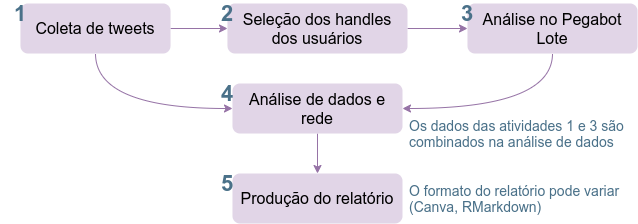

# Análises

Hoje as análises que envolvem o Pegabot seguem o seguinte fluxo:

Alguns dos processos de análise que temos implementados são:
1. Para relatórios que vão servir para a elaboração de threads, e que precisam ser produzidos em menos tempo, fazemos uma seleção dos usuários que vão ser analisados no Pegabot. Uma opção é selecionar, a partir da coleta de tweets, os usuários que tiveram maior frequência de postagens. O relatório é produzido de forma automática (e precisa ser verificado) com um script de análise em R e um template de rmarkdown.

2. Para relatórios que podem ser produzidos em mais tempo, passamos todos os handles para o Pegabot. Os resultados das análises são organizados em um [template no Canva](https://www.canva.com/design/DAE-jeCeplA/kYQaZDKV34ia-C5xEcE0yw/edit?utm_content=DAE-jeCeplA&utm_campaign=designshare&utm_medium=link2&utm_source=sharebutton).

3. Relatórios de colaboração/parceria com outras organizações normalmente possuem demandas específicas e são avaliados individualmente.

Para o item 1, os scripts R e arquivos úteis estão no diretório *rmarkdown*. Para os itens 2 e 3, os arquivos estão no diretório *completa*.

### Nota importante
Dependendo da demanda, não é viável analisar todos os usuários no Pegabot lote. Alguns relatórios precisam ser produzidos de forma mais ágil e o volume dos usuários que publicaram os tweets coletados pode ser muito grande. Lembrando, o Pegabot lote consegue analisar em torno de 10 mil perfis por dia.

Pensando nisso, pode ser relevante passar apenas uma amostra dos usuários pelo Pegabot lote. Sendo assim, uma subetapa etre as atividades 2 e 3 passa a existir: seleção da amostra de usuários.
Uma das possibilidades é analisar usuários que tiveram maior volume de tweets para os dados coletados (do twint). 
O script **filtro_usuarios.R* tem um exemplo (pode ser adaptado!, não é uma regra) de como selecionamos esses usuários para seguir para a etapa 3.

