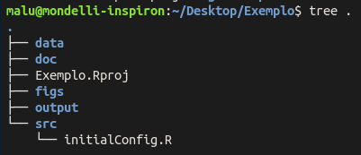

# Análise completa

Aqui estão scripts úteis  para a realização de análises que usam dados do Pegabot e tweets coletados, implementadas usando a liguagem R. A seguir, é descrito o fluxo de execução de cada um dos arquivos presentes:

### Configuração e preparação do projeto
Para manter uma estrutura limpa de códigos e deixar os arquivos organizados, a sugestão é criar um diretório e, no caso do R, um projeto para cada análise.
Uma vez criado o projeto, é possível utilizar o pacote staRt para criar a estrutura de subdiretórios dentro do projeto. O pacote busca seguir boas práticas para implementação de análises, como sugerido [neste artigo](https://www.rforecology.com/post/organizing-your-r-studio-projects/). Para instalar o pacote:

    library(devtools)
    install_github("mmondelli/staRt")
    
Para criar a estrutura de subdiretórios:

    library(staRt)
    staRt::create('.')
    
Como resultado, o diretório do projeto terá a seguinte estrutura:

.

### Scripts
Neste repo, os scripts contém os comandos que são executados com frequência, mas apenas como exemplo. A produção dos relatórios não precisa estar limitada à eles!
Esses scripts podem ficar no diretório raiz do projeto, como sugerido no [neste artigo](https://www.rforecology.com/post/organizing-your-r-studio-projects/).

 - 0_setup.R: contém as instruções para criação da estrutura de subdiretórios mencionada anteriormente e carrega as bibliotecas úteis para execução das análises, que estão listadas no arquivo src/initialConfig.R.
 - 1_clean_data.R: em alguns momentos pode ser útil/relevante fazer limpeza dos dados. Para organização, vale manter as instruções de limpeza separadas da análise.
 - 2_analysis.R: contém os comandos para tratamento, manipulação, análise e visualização dos dados. Nem todas as análises serão úteis para incluir num relatório, mas as perguntas que cada trecho de código se propõe a responder estão separadas como seções neste arquivo.
 - 3_text_analysis.R: para análises mais focadas no conteúdo dos tweets coletados, pode ser interessante manter o código separado, a fim de evitar que o arquivo de análise (que é mais geral) fique muito extenso.

