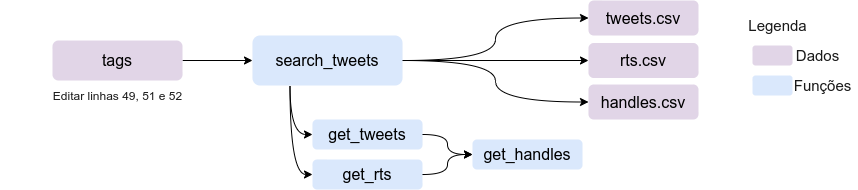

# Coletas pontuais

Aqui está o script utilizado para coletas pontuais de hashtags ou menções, que não demandam monitoramento semanal como nos projetos de Eleições Chile e Democracia em Xeque.

O script getData.py executa o seguinte fluxo de atividades:
  

Para a execução da versão atual do script, é necessário modificar as sequintes linhas, conforme as tags e datas de interesse:
- linha 49: incluir as tags ou @ de usuários que precisam ser coletados, podendo ser um ou mais.
- linhas 51 e 52: ajustar as datas de início e fim da coleta.

O script busca por tweets e retweets para cada tag/usuário definido na planilha, usando o Twint. Uma vez coletado, a função *get_handles* seleciona os handles dos usuários que fizeram as publicações, sem repetição. Esse arquivo handles.csv pode ser utilizado para inserção no Pegabot lote. Esse processo é feito para cada tag/usuário a ser buscado. Ao final, a função *search_tweets* também concatena todos os resultados, separadamente para o que é tag e o que é mention, e produz dois arquivos de saída: all_tweets.csv contendo todos os tweets e RTs, e all_handles.csv, contendo a listagem de handles de usuários.

Para executar:

`python3 getData.py`

